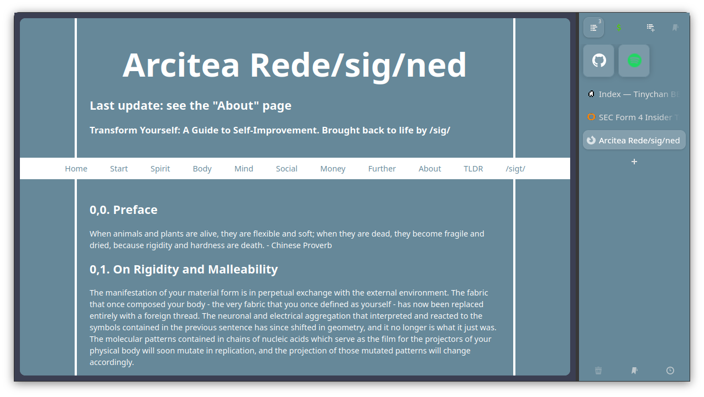

# dmbarrad's configs of his FireFoxy
This is My modified version of arcfox from betterbrowser.  
I don't use thier addons, i use configured sidebery.  
I also use Adaptive Tab Bar Color Extension, which makes the entire browser adapt to the website's colors.  

# What is ArcFox?
ArcFox is an improvment of the appearance of Firefox inspired by The Arc browser . 

# Installation
### ArcFox-Theme Installation
To install arcfox-theme you need to open your firefox configurations and turn style modification on. To do that please follow this steps:
- Digit <a href="about:config">"about:config"</a> on firefox address bar and click enter.
- On the search bar, search for "toolkit.legacyUserProfileCustomizations.stylesheets" and set the value to "true".
- Open <a href="about:support">"about:support"</a> and click on the “Open Folder” button on the right of "Profile Folder" to open it.
- When the folder opens, search for a folder called "chrome", if you don't find it create one.
- Inside the "chrome" folder, drop the "userChrome.css" that you find under themes/ folder
- Restart firefox.

# Removing ArcFox
If you have a major issue, or just want a different/default look, here is how to remove ArcFox.
1. Remove `(Firefox Profile)/chrome/userchrome.css`
2. Remove the 'ArcFox' extension from Firefox
3. Restart your Firefox session, and it should be fixed! If not, make an issue in the issues tab
4. Be happy with your now boring and unproductive firefox!

# Support
Please if you're going to donate, give it to the original maker of this theme. [ko-fi](https://ko-fi.com/nikollesan) page

# License
My version goes under the AGPL-3.0-only+NIGGER License
